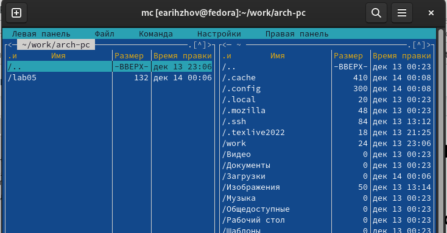
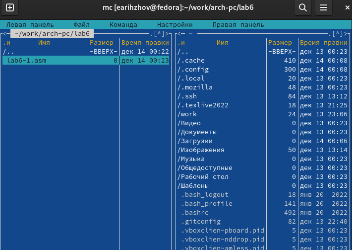
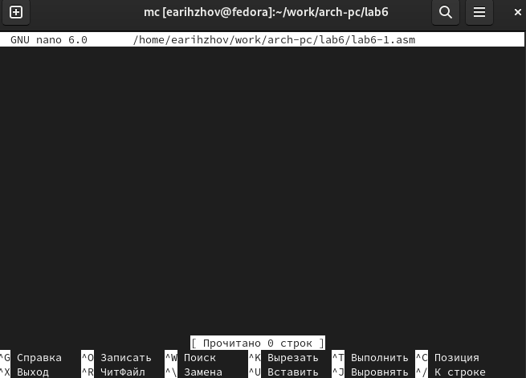
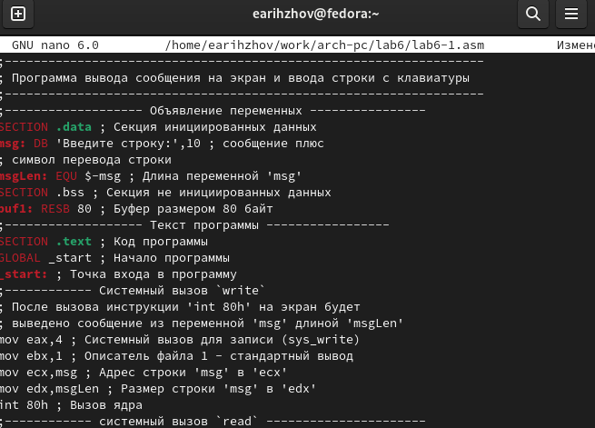
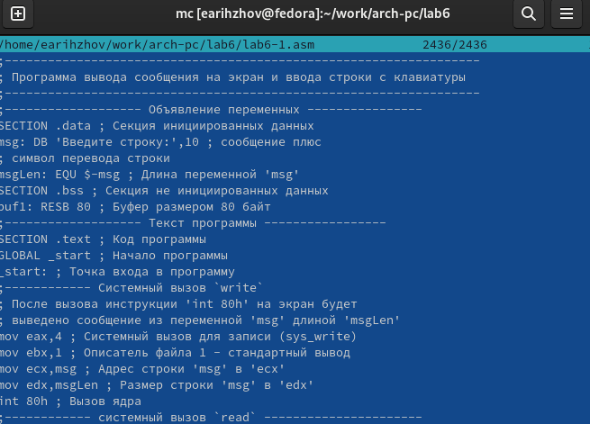
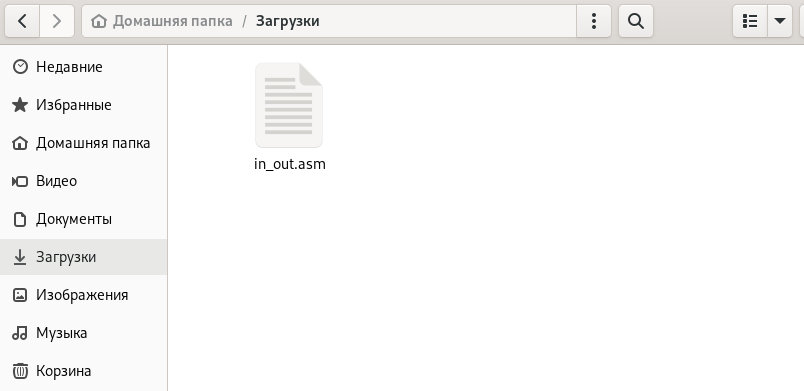
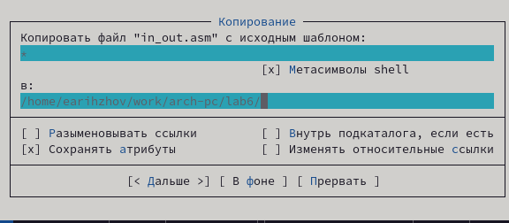
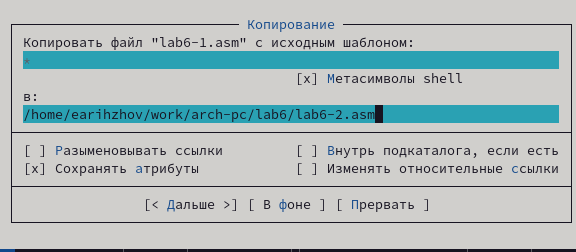
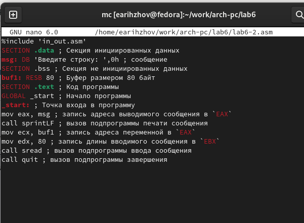
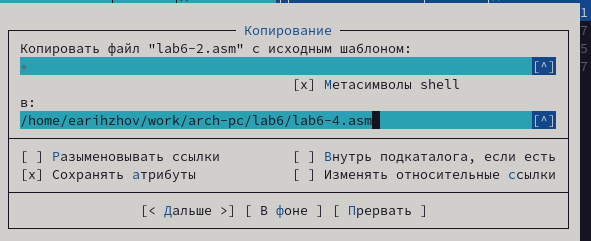

---
## Front matter
title: "Отчет по лабораторной работе № 6"
subtitle: "Архитектура компьютера"
author: "Егор Рыжов"

## Generic otions
lang: ru-RU
toc-title: "Содержание"

## Bibliography
bibliography: bib/cite.bib
csl: pandoc/csl/gost-r-7-0-5-2008-numeric.csl

## Pdf output format
toc: true # Table of contents
toc-depth: 2
lof: true # List of figures
fontsize: 12pt
linestretch: 1.5
papersize: a4
documentclass: scrreprt
## I18n polyglossia
polyglossia-lang:
  name: russian
  options:
	- spelling=modern
	- babelshorthands=true
polyglossia-otherlangs:
  name: english
## I18n babel
babel-lang: russian
babel-otherlangs: english
## Fonts
mainfont: PT Serif
romanfont: PT Serif
sansfont: PT Sans
monofont: PT Mono
mainfontoptions: Ligatures=TeX
romanfontoptions: Ligatures=TeX
sansfontoptions: Ligatures=TeX,Scale=MatchLowercase
monofontoptions: Scale=MatchLowercase,Scale=0.9
## Biblatex
biblatex: true
biblio-style: "gost-numeric"
biblatexoptions:
  - parentracker=true
  - backend=biber
  - hyperref=auto
  - language=auto
  - autolang=other*
  - citestyle=gost-numeric
## Pandoc-crossref LaTeX customization
figureTitle: "Рис."
tableTitle: "Таблица"
listingTitle: "Листинг"
lofTitle: "Список иллюстраций"
lolTitle: "Листинги"
## Misc options
indent: true
header-includes:
  - \usepackage{indentfirst}
  - \usepackage{float} # keep figures where there are in the text
  - \floatplacement{figure}{H} # keep figures where there are in the text
---

# Цель работы

Приобретение практических навыков работы в Midnight Commander.
Освоение инструкций языка ассемблера mov и int.

# Задание

Создать исполняющие файлы из файлов ассемблера, реализующие ввод и вывод текста.

# Выполнение лабораторной работы

## Работа с Midnight Commander

Открыли Midnight Commander (рис. [-@fig:001])

{ #fig:001 width=70% }

Пользуясь клавишами ↑ , ↓ и Enter перешли в каталог ~/work/arch-pc,
 созданный при выполнении лабораторной работы №5. (рис. [-@fig:002])
 
{ #fig:002 width=70% }
 
С помощью функциональной клавиши F7 создали папку lab06
и перешли в созданный каталог. (рис. [-@fig:003])
 
{ #fig:003 width=70% }
 
 Пользуясь строкой ввода и командой touch создайте файл lab6-1.asm. (рис. [-@fig:004]), (рис. [-@fig:005])
 
{ #fig:004 width=70% }

{ #fig:005 width=70% }
 
С помощью функциональной клавиши F4 откройте файл lab6-1.asm для
редактирования во встроенном редакторе. (рис. [-@fig:006])
 
{ #fig:006 width=70% }

Ввели текст программы из листинга 6.1,
сохранили изменения и закрыли файл. (рис. [-@fig:007])

{ #fig:007 width=70% }

С помощью функциональной клавиши F3 открыли файл lab6-1.asm для
просмотра. Убедились, что файл содержит текст программы. (рис. [-@fig:008])

{ #fig:008 width=70% }

Оттранслировали текст программы lab6-1.asm в объектный файл. 
Выполнили компоновку объектного файла и запустили получившийся 
исполняемый файл. Программа вывела строку 'Введите строку:' и ожидала ввода с
клавиатуры. На запрос ввели свою фамилию и имя. (рис. [-@fig:009])

{ #fig:009 width=70% }

Скачали файл in_out.asm со страницы курса в ТУИС. (рис. [-@fig:010])

{ #fig:010 width=70% }

Подключаемый файл in_out.asm должен лежать в том же каталоге, что и
файл с программой, в которой он используется.
В одной из панелей mc открыли каталог с файлом lab6-1.asm. В другой панели
каталог со скаченным файлом in_out.asm. 
Скопировали файл in_out.asm в каталог с файлом lab6-1.asm
с помощью функциональной клавиши F5.(рис. [-@fig:011]) 

{ #fig:011 width=70% }

С помощью функциональной клавиши F6 создали копию файла lab6-
1.asm с именем lab6-2.asm. Выделили файл lab6-1.asm, нажали клавишу
F6 , ввели имя файла lab6-2.asm и нажали клавишу Enter. (рис. [-@fig:012])

{ #fig:012 width=70% }

Исправили текст программы в файле lab6-2.asm с использование подпрограмм 
из внешнего файла in_out.asm (использовали подпрограммы
sprintLF, sread и quit) в соответствии с листингом 6.2. 
Создали исполняемый файл и проверили его работу. (рис. [-@fig:013]), (рис. [-@fig:014])

{ #fig:013 width=70% }

{ #fig:014 width=70% }

В файле lab6-2.asm заменили подпрограмму sprintLF на sprint. 
Создали исполняемый файл и проверили его работу. При замене 
подпрограмм пропадает перенос строки перед вводом текста. (рис. [-@fig:015]), (рис. [-@fig:016])

{ #fig:015 width=70% }

{ #fig:016 width=70% }

## Задание для самостоятельной работы

Создали копию файла lab6-1.asm. Внесли изменения в программу (без
использования внешнего файла in_out.asm), так чтобы она работала по
следующему алгоритму:
1. вывести приглашение типа “Введите строку:”;
2. ввести строку с клавиатуры;
3. вывести введённую строку на экран.

(рис. [-@fig:017]), (рис. [-@fig:018])

{ #fig:017 width=70% }

{ #fig:018 width=70% }

Получили исполняемый файл и проверили его работу. На приглашение
ввести строку ввели свою фамилию. (рис. [-@fig:019])

{ #fig:019 width=70% }

Создали копию файла lab6-2.asm. Исправили текст программы 
с использованием подпрограмм из внешнего файла in_out.asm, 
так чтобы она работала по следующему алгоритму:
1. вывести приглашение типа “Введите строку:”;
2. ввести строку с клавиатуры;
3. вывести введённую строку на экран.

(рис. [-@fig:020]), (рис. [-@fig:021])

{ #fig:020 width=70% }

{ #fig:021 width=70% }

Создали исполняемый файл и проверили его работу. (рис. [-@fig:022])

{ #fig:022 width=70% }

# Выводы

В ходе выполненя лобороторной работы были приобретены практическиы навыки работы в Midnight Commander и
освоены инструкции языка ассемблера mov и int.

::: {#refs}
:::
